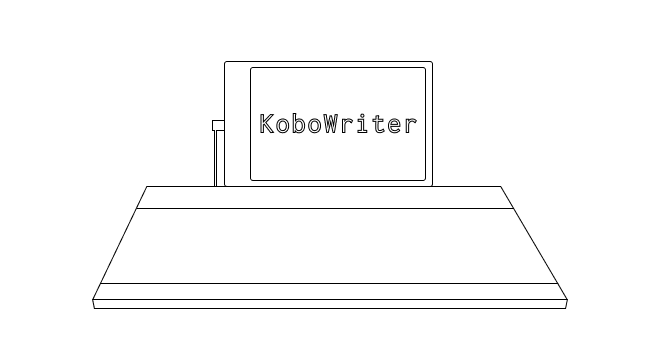
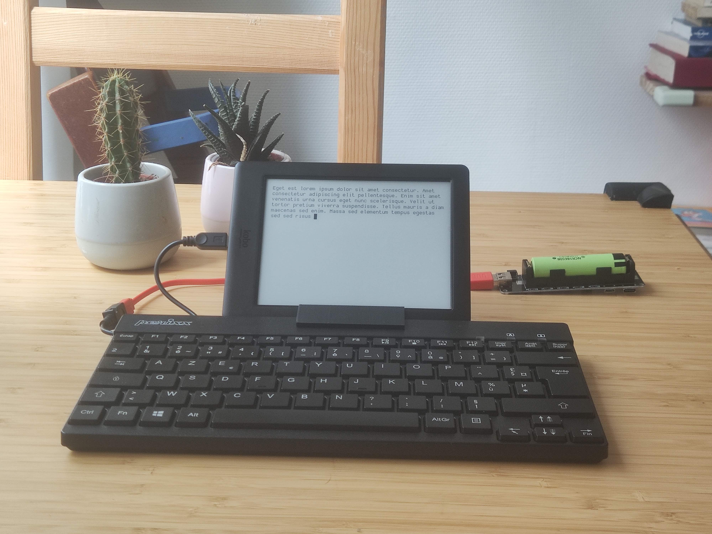
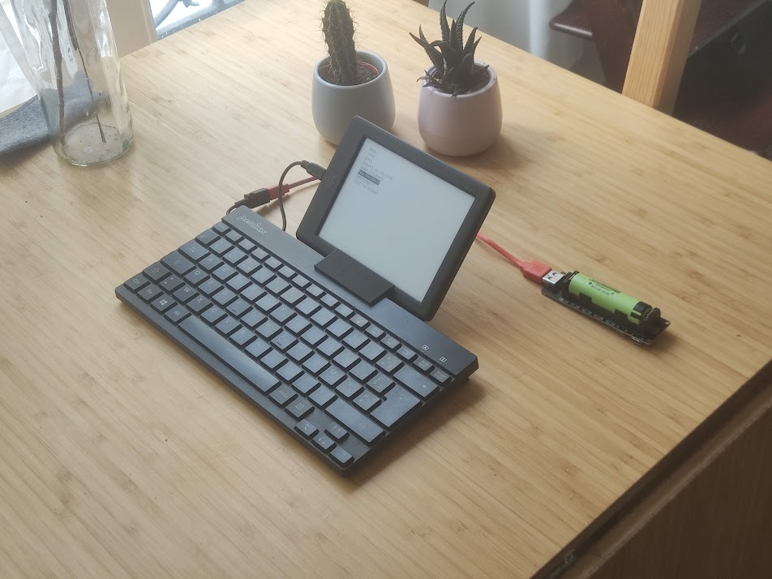

  

# Kobowriter

This small project aims to let you use your old KOBO e-reader (mine is a GLO HD) as a simple, distraction free typewriter.

For years I thought that e-ink was the ultimate medium to write in broad daylight without eye strain or focus fatigue. It seems that others have had the same ideas, as we can see in the [Freewrite](https://getfreewrite.com/) or [Pomera](https://www.kickstarter.com/projects/2132003782/pomera-pocket-typewriter-with-e-ink?ref=category_newest&amp;ref=discovery) products.

This project brings the same form factor in a considerably cheaper way (especially if like me you already have a KOBO at hand).

> Note that the installed software should let you use switch between your normal kobo stock software and the KoboWriter one; so your kobo is still usable in its default way.

> Because XCSoar USB OTG should work for many KOBO devices (touch, Mini, Glo HD and pretty much all the later ones), this project would work there too. But as of now this program has only been built and tested for the KOBO GLO HD and only supports the AZERTY (French) keyboard. You can open issues if you need to support other devices / keyboards

## How it looks

## How it works

The kobo e-readers have a Micro-USB connector to charge and transfer files. With proper kernel modification this USB socket can be used as OTG, letting one plug in any kind of USB device.

Such kernel was compiled by the [XCSoar](https://github.com/XCSoar/XCSoar) project in order to turn the kobo into a fliying assistant supported by an external GPS. 

We use their modifications to connect a USB keyboard to the OTG port.

However, the kobo giving no power through its USB socket, the keyboard has to be powered on its own - you can either use a cheap USB otg power cable [like this one](https://www.amazon.com/AuviPal-Micro-USB-Cable-Power/dp/B07FY9Z9GD/ref=sr_1_3?crid=13TQ5BP3TUJT5&dchild=1&keywords=powered+usb+otg&qid=1630094365&sprefix=powered+%2Caps%2C536&sr=8-3) or modify the keyboard, like I did.

The software lets you use the keyboard to write and edit text files. It's coded in Go, compiled with a toolchain prepared for the KOBO devices, and relies largely on the excellent [FBInk](https://github.com/NiLuJe/FBInk) library to drive the screen, through its extremely useful port in Go, [go-fbink](https://github.com/shermp/go-fbink-v2).

## How to build it

> Note that we also provide ready made precompiled binaries for your KOBO

First you need to download and build the **koxtoolchain** on your development computer. This toolchain, once built, will let you build Go programs that can run on the KOBO.

*TODO : Detailed step to build project*

## How to install

You can build the software, put it on a KOBO with XCSoar software, and launch it any way you see fit.

Or you can use our modified XCSoar installer that will get you the XCSoar program, kernel, and Kobowriter in just one step:

> You do this at your own risk!

- Download the `KoboRoot.tar.gz` from the release page
- Connect your Kobo and place the archive in the .kobo (hidden) directory
- eject safely, unplug, and let the Kobo update
  
From now on your Kobo will start up on XCSoar launcher. From there you can start the stock Kobo software, turn on USB-OTG or start the KoboWriter.

> Note that when USB-OTG is enable, you won't be able to start the stock Kobo software. But you need to have it on in order to use the KoboWriter software. Changing the USB-OTG setting requires a restart.

- When you start the KOBO, if not activated yet, from the XCSoar laucher tap on `system` and the `enable USB-OTG` and then restart the device.

If, like me, you use the KOBO only for KoboWriter, then your device should always boot in this state. In this case, only this last step is required:

- From XCSoar launcher tap `tools` and then `KoboWriter`.

Plugin you powered USB keyboard and you should be good to go ;-)
